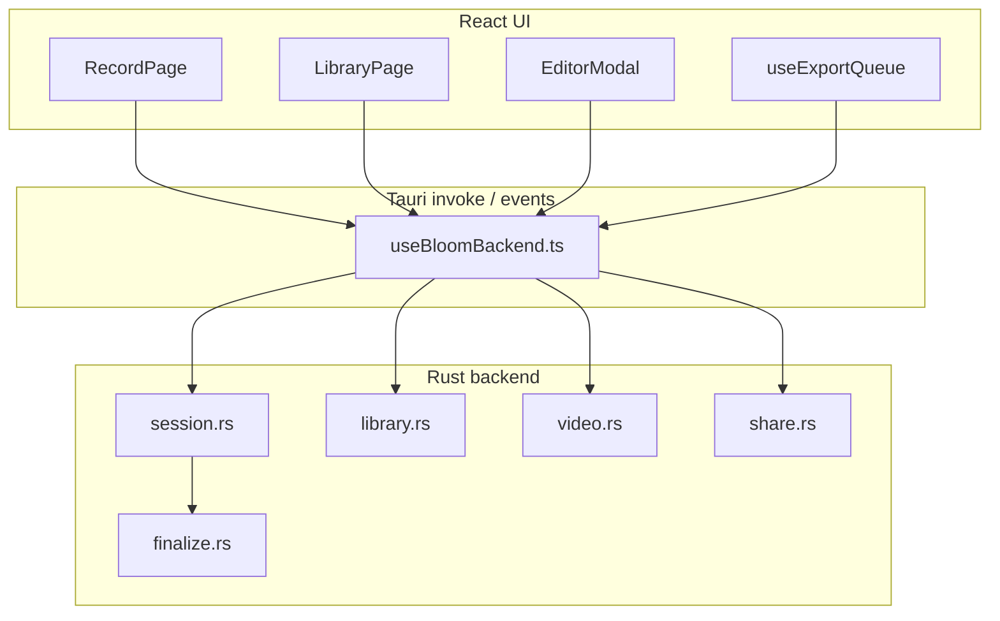

# Vývoj Bloom

Príručka pre vývojárov. Kód je rozdelený na React frontend (`src/`) a Rust backend (`src-tauri/src/`).

## Architektúra



### Okná aplikácie

| Label | Účel |
|-------|------|
| `main` | Hlavná app — nahrávanie, knižnica, nastavenia |
| `annotate` | Kreslenie počas nahrávania |
| `recording-hud` | HUD počas nahrávania |
| `cursor-overlay` | Spotlight kurzora |
| `monitor-highlight` | Orámovanie vybraného displeja |

Konfigurácia: `src-tauri/tauri.conf.json`, capabilities: `src-tauri/capabilities/default.json`.

## Frontend

### Stack

- React 19, TypeScript, Vite 7
- Tailwind CSS 4 (`src/index.css` — design tokeny, témy)
- Radix UI primitívy (`src/components/ui/`)
- Mac-like komponenty: `src/components/mac/` (`MacUIKit`, `MacSelect`)

### Kľúčové moduly

| Modul | Popis |
|-------|--------|
| `useBloomBackend.ts` | Jediný vstupný bod na Tauri príkazy |
| `useSettings.tsx` | Téma, predvoľby, perzistencia v IndexedDB |
| `useExportQueue.tsx` | Fronta exportov — sériové spracovanie `optimize_video` |
| `lib/i18n/sk.ts` | Všetky user-facing reťazce |
| `lib/capture.ts` | MediaRecorder, getDisplayMedia, PiP |
| `lib/editorSegments.ts` | Logika multi-clip segmentov |

### Pridanie textu do UI

1. Pridajte kľúč do `src/lib/i18n/sk.ts`.
2. Importujte `sk` v komponente — nepíšte anglické reťazce priamo do JSX.

### Pridanie Tauri príkazu

1. Implementujte `#[tauri::command]` v Rust moduli.
2. Zaregistrujte v `src-tauri/src/lib.rs` → `invoke_handler`.
3. Pridajte typy do `src/types/index.ts` ak treba.
4. Pridajte wrapper do `useBloomBackend.ts`.
5. Dokumentujte v `docs/backend.md`.

## Backend (Rust)

Moduly:

| Súbor | Zodpovednosť |
|-------|----------------|
| `session.rs` | Otvorenie súboru, chunk stream, zatvorenie → finalize |
| `finalize.rs` | faststart remux, ffprobe dĺžka, miniatúra |
| `library.rs` | CRUD knižnice, validácia, sidecar JSON |
| `video.rs` | ffmpeg detekcia, export, filmstrip, odhad |
| `share.rs` | macOS NSSharingServicePicker |
| `system.rs` | Monitory, disk, bloom_dir |
| `cursor.rs` | Sledovanie pozície kurzora pre overlay |
| `tray.rs` | Menu lišta a globálne skratky |

## Udalosti (events)

| Event | Payload | Zdroj |
|-------|---------|-------|
| `video-progress` | `OptimizeProgress` | `video.rs` — priebeh exportu |

Frontend: `onOptimizeProgress()` v `useBloomBackend.ts`.

## Testy

```bash
# Frontend
bun run test

# Backend
cd src-tauri && cargo test
```

Rust testy: `src-tauri/src/__tests__/` (video pipeline, finalize, util).

Frontend testy: Vitest + Testing Library (`src/lib/__tests__/`, `src/components/**/__tests__/`).

## Build a release

```bash
bun run build          # len frontend do dist/
bun run tauri build    # .app / inštalátor
```

Asset protocol v `tauri.conf.json` povoľuje `<video src>` cez `convertFileSrc()` len pre súbory v `~/Movies/Bloom/**`.

## Štýl kódu

- Minimálny scope — žiadne refaktory mimo úlohy
- Slovenské UI reťazce len v `sk.ts`
- Rust chyby ako `Result<T, String>` pre invoke
- Preferujte existujúce Mac komponenty pred novými abstrakciami

## Ďalšie čítanie

- [backend.md](./backend.md) — dátový model, ffmpeg pipeline, zoznam príkazov
- [pouzivanie.md](./pouzivanie.md) — používateľská príručka
